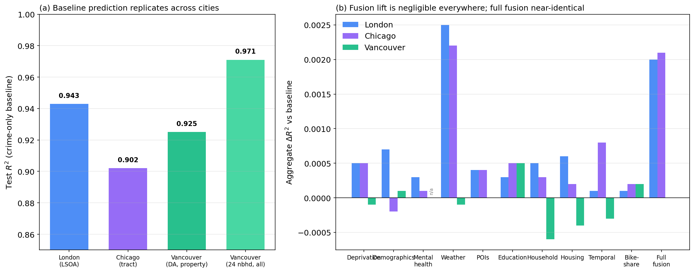
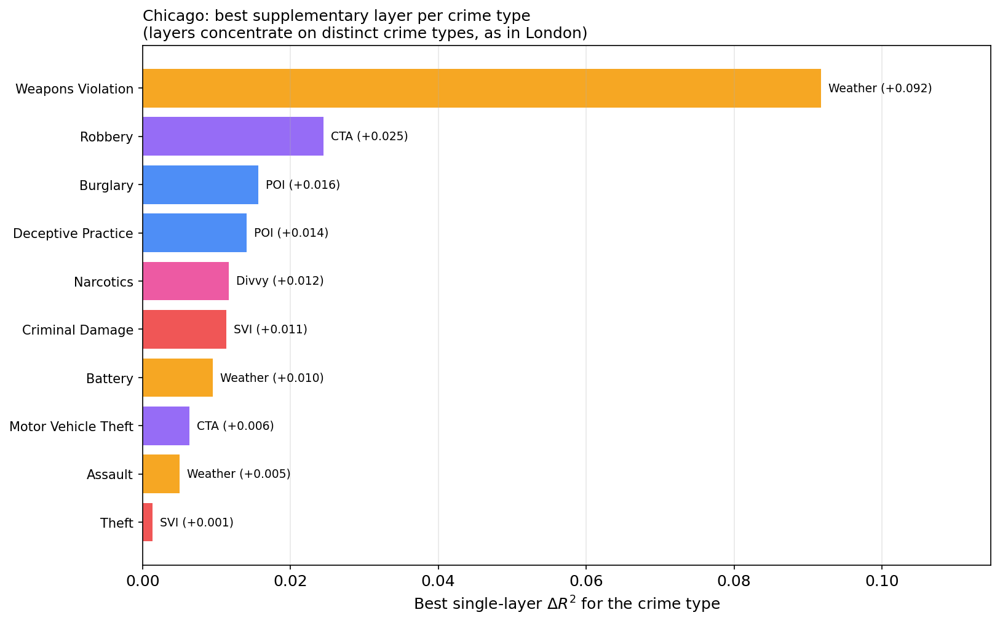

# Crime Prediction with Multi-Source Data Fusion

[](https://www.python.org/downloads/)
[](LICENSE)

**MSc Thesis Research** | Trinity College Dublin | 2025-2026

> *Uncovering What Drives Crime: A Data Fusion Approach to Spatio-Temporal Prediction and Contributing Factor Analysis*

## Overview

This repository contains the complete experiment code for an MSc thesis investigating whether supplementary open data sources (deprivation indices, weather, demographics, points of interest, housing prices, transport ridership, mental health, education, and household composition) can improve monthly neighbourhood-level crime prediction beyond what crime history alone provides. The study is built on London and then **replicated end-to-end in Chicago and Vancouver** to test how far the findings generalise.

**The short answer: at the aggregate level, no. At the per-crime-type level, dramatically yes. And it holds across all three cities.**

### Key Findings

| Finding | Detail |
|---------|--------|
| **Baseline** | Crime history alone achieves R² = 0.943 (Random Forest, 11 features) |
| **Aggregate ceiling** | 13 supplementary data layers produce a combined lift of only +0.002 |
| **Noise floor** | Model error is statistically indistinguishable from the theoretical Poisson limit for 90% of neighbourhoods |
| **Per-type signal** | Points of interest lift weapons prediction by +0.049 (bootstrap 95% CI [+0.013, +0.080]), the largest robust single improvement in the study |
| **Algorithm-independent** | Random Forest, XGBoost, and LSTM all agree on the ceiling |
| **Cross-city** | The ceiling replicates in Chicago (R² = 0.902) and Vancouver (R² = 0.925); full-fusion lift is near-identical to London (+0.0021 vs +0.0020) |
| **Open vs gated** | Where a richer layer looks "missing" in a city, it is usually gated behind a research agreement (police records, PopData BC, transit tap data), not absent |
| **6 SHAP profiles** | Each crime type has a distinct driver profile (transit-node, deprivation, seasonality, commercial-proximity, pure-persistence, crowd-dynamics) |

### Study Areas

- **London, UK** (primary): 5,148 LSOAs, 36 months (Feb 2023 to Jan 2026), 3.4 million street-level crime records, 14 offence categories.
- **Chicago, USA**: 814 census tracts, point-level crime (Chicago Data Portal), 31 offence types.
- **Vancouver, Canada**: 461 dissemination areas (property crime; violent-crime coordinates are suppressed under BC privacy law), plus a 24-neighbourhood all-crime run.

## Project Structure

```
crime-prediction-data-fusion/
├── README.md
├── LICENSE
├── EXPERIMENTS.md              # Complete experiment index
├── requirements.txt            # Python dependencies
│
├── data/
│   ├── README.md               # Data acquisition guide (step-by-step)
│   ├── data_sources.md         # Full data source catalogue with URLs
│   ├── data_quality_log.md     # Data quality observations
│   └── cross_city_feasibility.md  # 3-city results + open-vs-gated analysis
│
├── notebooks/
│   ├── eda/                    # London experiment scripts (01-32 + 23_shap)
│   ├── chicago/                # Chicago replication pipeline (download + fusion)
│   ├── vancouver/              # Vancouver replication pipeline (download + fusion)
│   ├── cross_city_charts.py    # Cross-city comparison figures
│   └── experimental/           # Deep learning (LSTM) experiments
│
├── scripts/                    # Data download utilities
│
├── src/                        # Reusable Python modules
│   ├── data/                   # Data loading and ingestion
│   ├── features/               # Feature engineering
│   ├── models/                 # Model definitions
│   ├── utils/                  # Configuration, paths
│   └── visualization/          # Streamlit explorer app
│
└── reports/
    └── figures/                # Generated plots and charts
        ├── baseline/  eda/  error_analysis/  fusion/  per_type/
        ├── shap/  transport/  weather/  xgboost/
        └── cross_city/         # London / Chicago / Vancouver comparison
```

## Setup

```bash
git clone https://github.com/aggarwamnew/crime-prediction-data-fusion.git
cd crime-prediction-data-fusion
python -m venv venv
source venv/bin/activate          # macOS/Linux ; venv\Scripts\activate on Windows
pip install -r requirements.txt
```

### Data Acquisition

Raw data is not included in this repository (licensing and size). See [`data/README.md`](data/README.md) for step-by-step download instructions for every source across all three cities, with exact URLs, dataset IDs, and directory placement. All sources are open government / open data licences.

## Running Experiments

Scripts are numbered in execution order and are self-contained (console metrics + saved figures). Each city has its own pipeline that reuses the same modelling logic (identical features, Random Forest configuration, and temporal split).

```bash
# London
python notebooks/eda/03_baseline_model.py        # Baseline RF (R² = 0.943)
python notebooks/eda/07_weather_fusion.py         # Weather fusion, etc.

# Chicago replication
python notebooks/chicago/01_download_crime.py     # pull crime (Socrata API)
python notebooks/chicago/03_baseline_model.py     # Baseline RF (R² = 0.902)
python notebooks/chicago/11_full_fusion.py        # Full fusion (+0.0021)
python notebooks/chicago/12_per_type.py           # Per-crime-type ablation

# Vancouver replication
python notebooks/vancouver/03_baseline_model.py   # Baseline RF (R² = 0.925)

# Cross-city comparison figures
python notebooks/cross_city_charts.py
```

See [`EXPERIMENTS.md`](EXPERIMENTS.md) for the full experiment index, and [`notebooks/chicago/RESULTS.md`](notebooks/chicago/RESULTS.md) for the detailed Chicago replication results.

## Results Summary

### Aggregate Fusion (London, all crime types combined)

| Data Layer | Type | Delta R² | Features |
|------------|------|----------|----------|
| Crime history (baseline) | - | R² = 0.9430 | 11 |
| + Weather | Dynamic | +0.0025 | 5 |
| + IMD 2025 | Static | +0.0008 | 9 |
| + Demographics | Static | +0.0007 | 7 |
| + Housing | Static | +0.0006 | 3 |
| + POIs | Static | +0.0004 | 11 |
| + Mental health | Static | +0.0003 | 2 |
| **Full fusion (51 features)** | | **+0.0020** | **51** |

### Per-Crime-Type Highlights (London)

| Crime Type | Best Data Layer | Delta R² | Mechanism |
|------------|----------------|----------|-----------|
| Weapons | Points of interest (bus stops) | **+0.049** | Transport hub convergence |
| Drugs | IMD (deprivation) | +0.020 | Socioeconomic clustering |
| Bicycle theft | Weather | +0.013 | Warm weather = more cyclists |
| Theft from person | Temporal activity | +0.014 | Holiday crowds = more targets |
| Shoplifting | (none) | ~0 | Pure historical persistence |

### Cross-City Validation

The full pipeline was replicated in Chicago and Vancouver, holding the method fixed and varying only the city. The core findings transfer.

| City (unit) | Crime | Baseline R² | Full-fusion Δ R² |
|-------------|-------|-------------|------------------|
| London (LSOA) | all 14 types | 0.943 | +0.0020 |
| Chicago (census tract) | all 31 types, point-level | 0.902 | +0.0021 |
| Vancouver (dissemination area) | property only | 0.925 | (static layers ≈ 0) |
| Vancouver (24 neighbourhoods) | all crime, incl. violent | 0.971 | - |



Per-type heterogeneity also transfers: in Chicago, transit most improves robbery (+0.025), weather most improves weapons violations (+0.092), and points of interest most improve burglary (+0.016), mirroring London's finding that convergence-point and seasonal crimes are the most data-responsive.



A broader investigation (see [`data/cross_city_feasibility.md`](data/cross_city_feasibility.md)) finds that where a richer layer looks unavailable in a city, it is usually **gated** behind a research-access agreement rather than missing, mirroring the UK's restriction of finer crime detail to approved researchers.

## Data Sources

London sources are documented in [`data/data_sources.md`](data/data_sources.md); the cross-city sources (Chicago and Vancouver) are catalogued in [`data/cross_city_feasibility.md`](data/cross_city_feasibility.md) and [`data/README.md`](data/README.md).

| Tier | London | Chicago | Vancouver |
|------|--------|---------|-----------|
| Crime | data.police.uk | Chicago Data Portal | VPD GeoDASH |
| Deprivation | IMD | CDC/ATSDR SVI | CIMD |
| Weather | Met Office | NOAA GHCN-Daily | ECCC |
| Mental health | SAMHI | CDC PLACES | (gated) |
| Transit | TfL / PTAL | CTA + Divvy | TransLink / Mobi |

## Citation

```bibtex
@mastersthesis{aggarwal2026crime,
  title     = {Uncovering What Drives Crime: A Data Fusion Approach to
               Spatio-Temporal Prediction and Contributing Factor Analysis},
  author    = {Aggarwal, Mohit},
  school    = {Trinity College Dublin},
  year      = {2026},
  type      = {MSc Thesis},
  program   = {Computer Science (Intelligent Systems)}
}
```

## License

This project is licensed under the MIT License. See [LICENSE](LICENSE) for details.

## Acknowledgements

- Supervisor: Trinity College Dublin, School of Computer Science and Statistics
- London crime data: Home Office via [data.police.uk](https://data.police.uk/) (Open Government Licence); transport from Transport for London; deprivation from MHCLG; census from ONS; POIs from OpenStreetMap contributors (ODbL); mental health from the Place-based Longitudinal Data Resource (PLDR)
- Chicago data: City of Chicago Data Portal, US Census Bureau, CDC/ATSDR, NOAA, CDC PLACES, Chicago Transit Authority, Divvy
- Vancouver data: Vancouver Police Department GeoDASH, Statistics Canada, Environment and Climate Change Canada
